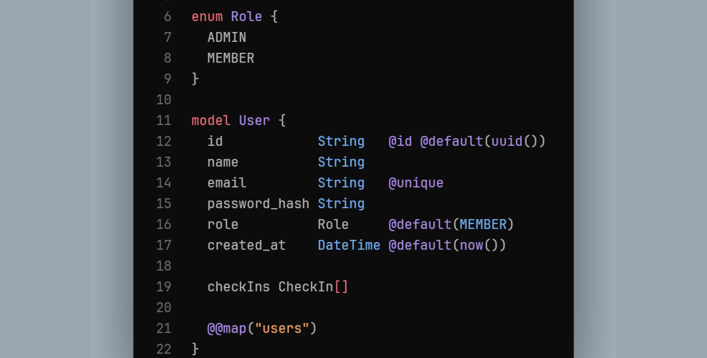

# Projeto de Simulação de API com Tecnologias Modernas

## Visão Geral

Este projeto é uma exploração inovadora de tecnologias modernas para desenvolvimento de APIs, focando em criar uma plataforma robusta e eficiente para testes e integrações. Utilizando TypeScript, Node.js, Prisma ORM, Vitests, Docker e PostgreSQL, este projeto demonstra a aplicação prática dessas tecnologias em um ambiente de desenvolvimento de API.

## Tecnologias Utilizadas
- **[TypeScript]**: Utilizado para adicionar tipagem estática ao projeto, melhorando a qualidade do código e facilitando a manutenção.
- **[Node.js]**: O coração do projeto, fornecendo a plataforma de execução para o servidor de API.
- **[Prisma ORM]**: Para facilitar o acesso e manipulação de dados no banco de dados PostgreSQL, oferecendo uma camada de abstração eficiente.
- **[Vitests]**: Para testes unitários e de integração, garantindo a qualidade do código e a funcionalidade da API.
- **[Docker]**: Para containerização do projeto, facilitando o desenvolvimento, teste e implantação em diferentes ambientes.
- **[PostgreSQL]**: Como banco de dados relacional, oferecendo uma solução robusta e escalável para armazenar e gerenciar dados.

## Como Utilizar
- **Clone o Repositório**: Clone este repositório para o seu ambiente de desenvolvimento local.
- **Instale as Dependências**: Execute `npm install` ou `yarn` para instalar todas as dependências necessárias.
- **Configure o Docker**: Certifique-se de que o Docker esteja instalado e configurado corretamente.
- **Inicie o Banco de Dados PostgreSQL**: Execute `docker-compose up` para iniciar o banco de dados PostgreSQL.
- **Inicie o Servidor**: Execute `npm start` ou `yarn start` para iniciar o servidor de API.
- **Execute os Testes**: Utilize `npm test` ou `yarn test` para executar os testes unitários e de integração.
